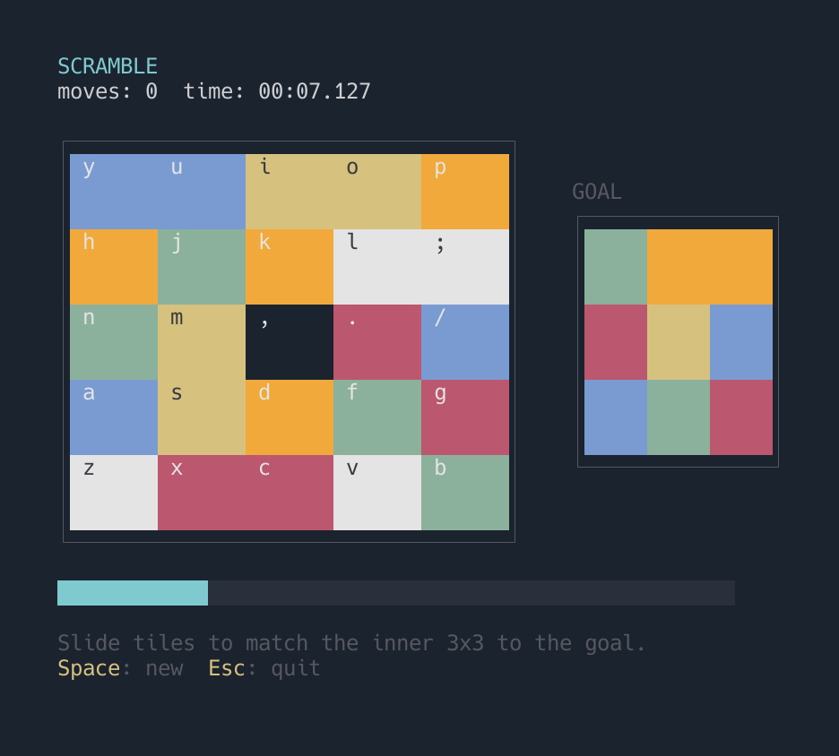

# scramble
Rubik's Race in your terminal



## How to Play

Slide the colored tiles on the 5x5 board so that the inner 3x3 matches the goal pattern shown to the right.

Press a tile's key to slide it (and any tiles between it and the empty space) toward the empty space.
Tiles must be in the same row or column as the empty space.

### Key Layout

The board maps to your keyboard, split across both hands:

**Right hand** (top of the board):
```
 y  u  i  o  p      1st row (top)
 h  j  k  l  ;      2nd row
 n  m  ,  .  /      3rd row (middle)
```

**Left hand** (bottom of the board):
```
 q  w  e  r  t      3rd row (middle)
 a  s  d  f  g      4th row
 z  x  c  v  b      5th row (bottom
```

Row 3 (middle) is accessible from both your left and right hand.

### Controls

- **Tile keys** - Slide a tile toward the empty space
- **Space** - Start a new game
- **Esc** - Quit

### Gameplay

A 3-second countdown plays before each game. Once it ends, the timer starts and you can begin sliding tiles.
A progress bar below the board tracks how many of the 9 inner tiles are in the correct position.
Match all 9 to the goal to win.
